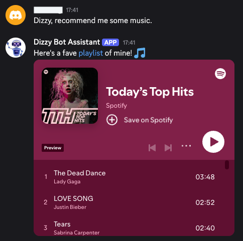

# Dizzy Bot

## Summary

Dizzy Bot is your Discord virtual assistant bot that can provide a variety of information such as world time, weather forecasts, music recommendations, and hockey scores.

## Images

<table align="center">
  <tbody>
    <tr>
      <th>World Time</th>
    </tr>
    <tr>
      <td></td>
    </tr>
  </tbody>
</table>

<table align="center">
  <tbody>
    <tr>
      <th>Weather Forecast</th>
    </tr>
    <tr>
      <td></td>
    </tr>
  </tbody>
</table>

<table align="center">
  <tbody>
    <tr>
      <th>Music Recommendations</th>
    </tr>
    <tr>
      <td></td>
    </tr>
  </tbody>
</table>

<table align="center">
  <tbody>
    <tr>
      <th>Hockey Scores</th>
    </tr>
    <tr>
      <td></td>
    </tr>
  </tbody>
</table>
