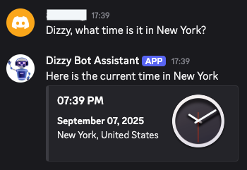

# Dizzy Bot

**Author:** Aron Saengchan

## Summary

Dizzy Bot is your Discord virtual assistant bot that can provide a variety of information such as world time, weather forecasts, music recommendations, and hockey scores.

To run the bot:

- Add the required API keys in the `.env` file
- Ensure you have [Docker Desktop](https://www.docker.com/products/docker-desktop/) installed on your device
- Build and run the containers by executing the `docker-compose up` command
- Add [Dizzy Bot](https://discord.com/oauth2/authorize?client_id=1169121939869147166&permissions=2183991392320&scope=bot) to a Discord server
- Type `'Dizzy help'` in the server to get a list of available commands
- Stop the containers by executing the `docker-compose down` command once finished

## Images

<table align="center">
  <tr align="center">
    <td>
      <b>World Time</b>
       
      
    </td>
    <td>
      <b>Weather Forecast</b>
       
      </td>
  </tr>
  <tr align="center">
    <td>
      <b>Music Recommendations</b>
       
      
    </td>
    <td>
      <b>Hockey Scores</b>
       
      
    </td>
  </tr>
</table>
